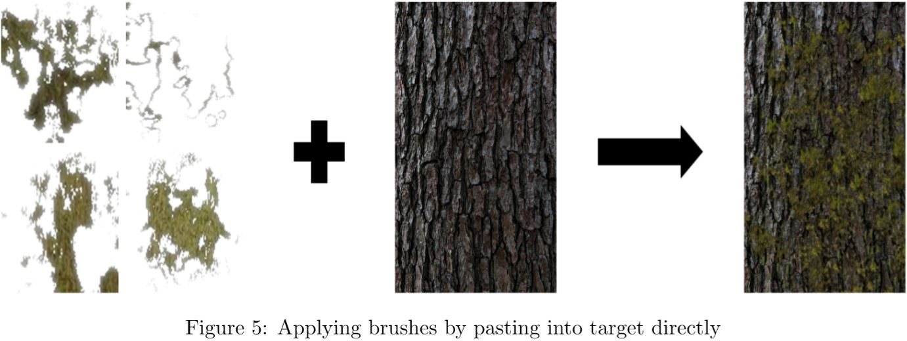

# Apply damage brushes to texture using noise

### Prerequisites
- Python
- numpy
- skimage
- Pillow
- pyamg
- scipy

### Test
```
bash test.sh
```
**OR**
```
python main.py --target ./input/wood3.jpg --brushesRoot ./brush/moss/feathered_cropped_brush --usePoisson
```
See `options.py` for more options about gride size, sigma or threshold for generating probability map.

See `main.py` line 77 to manipulate the probability.
